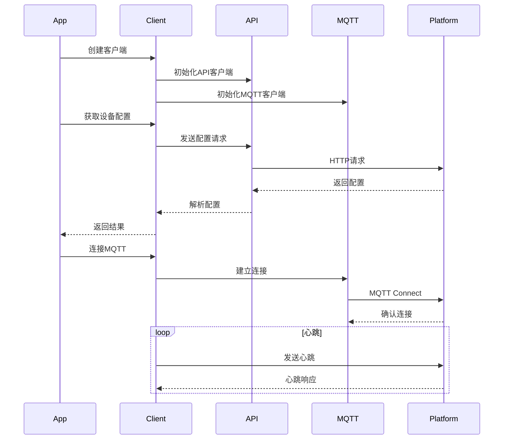

# 流程图

```mermaid
sequenceDiagram
    participant App
    participant Client
    participant API
    participant MQTT
    participant Platform

    App->>Client: 创建客户端
    Client->>API: 初始化API客户端
    Client->>MQTT: 初始化MQTT客户端
    
    App->>Client: 获取设备配置
    Client->>API: 发送配置请求
    API->>Platform: HTTP请求
    Platform-->>API: 返回配置
    API-->>Client: 解析配置
    Client-->>App: 返回结果
    
    App->>Client: 连接MQTT
    Client->>MQTT: 建立连接
    MQTT->>Platform: MQTT Connect
    Platform-->>MQTT: 确认连接
    
    loop 心跳
        Client->>Platform: 发送心跳
        Platform-->>Client: 心跳响应
    end
```
